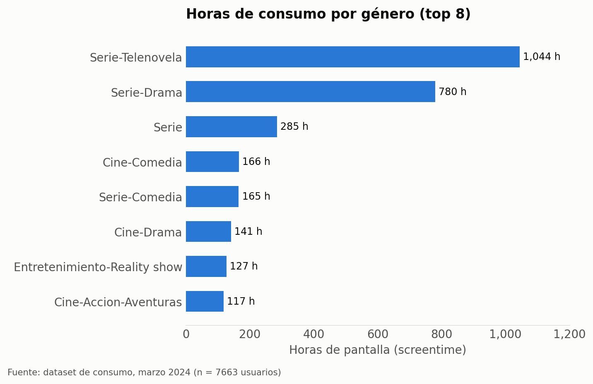
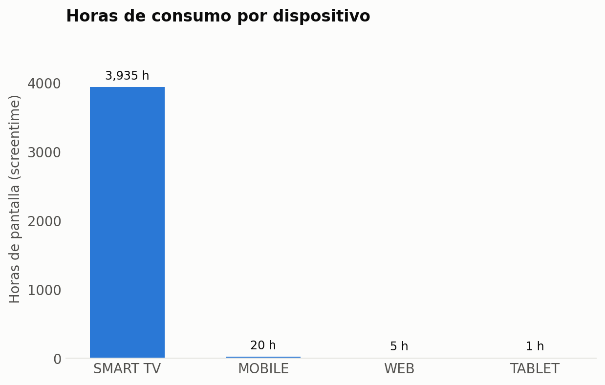
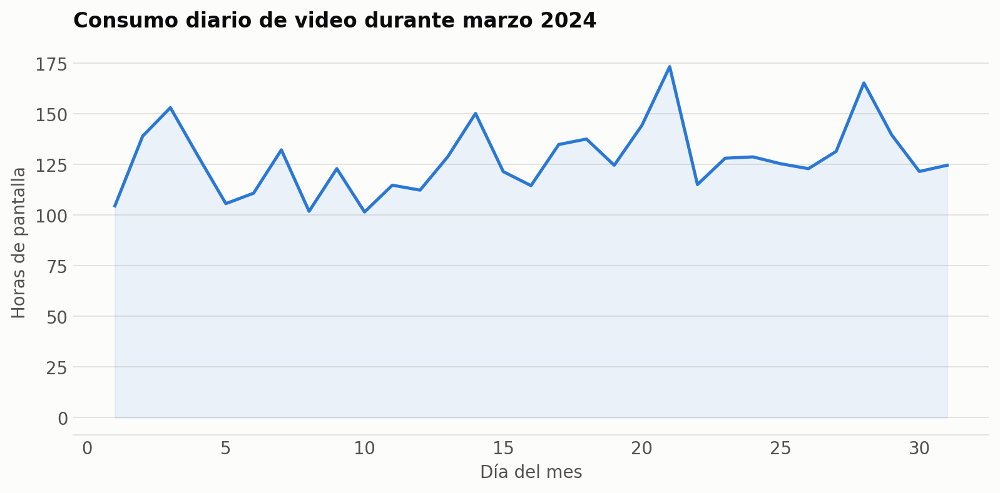
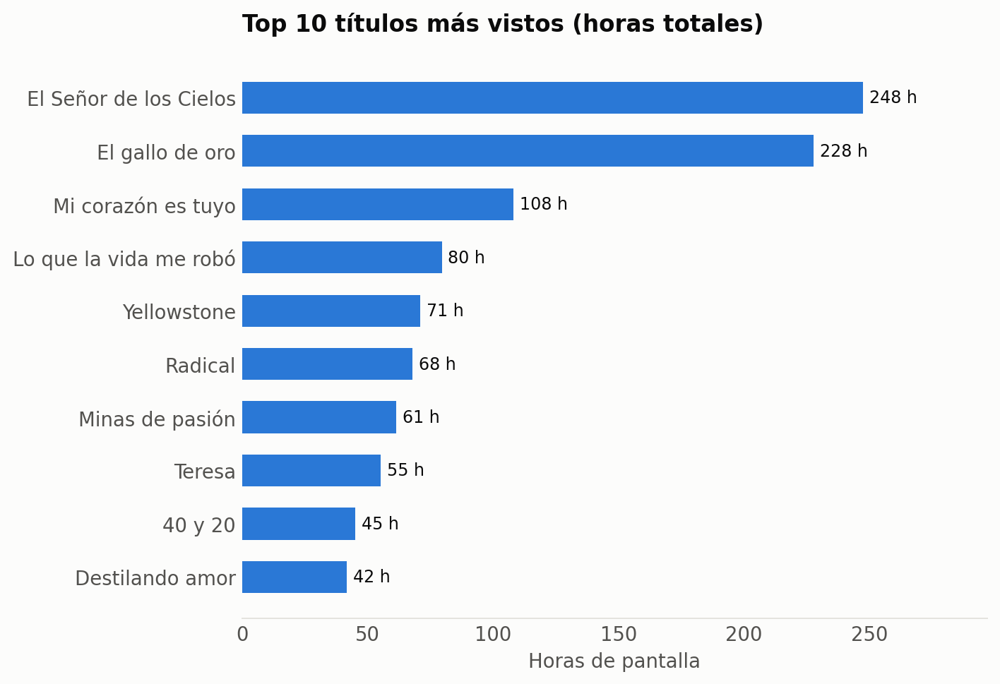
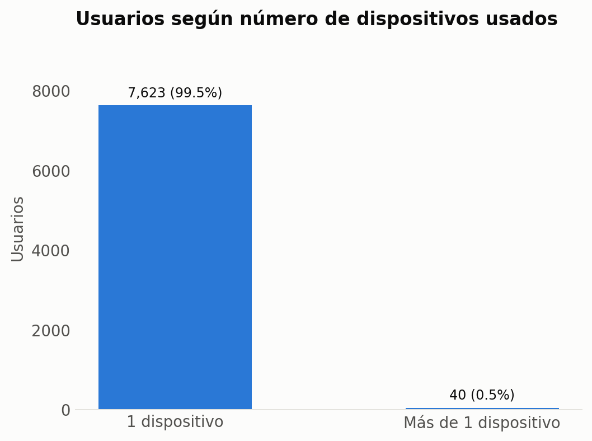
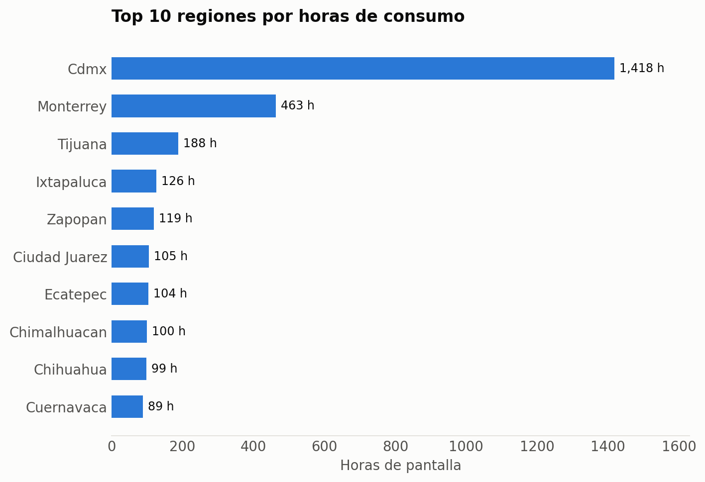

# Análisis de comportamiento de usuarios en plataforma de streaming

Análisis descriptivo del consumo de video de **7,663 usuarios** en una plataforma de streaming durante marzo de 2024, con el objetivo de identificar patrones de consumo por género, dispositivo, región y contenido para apoyar decisiones de negocio (qué producir, en qué dispositivo invertir experiencia de usuario, y qué regiones priorizar).

## Objetivo

Responder, a partir de datos crudos de reproducción, un conjunto de preguntas de negocio típicas de un equipo de datos/marketing:

1. ¿Cuántos usuarios consumen video en el mes?
2. ¿Cuál es el género más visto (por número de reproducciones y por horas de consumo)?
3. ¿Los usuarios consumen desde más de un dispositivo?
4. ¿Existe relación entre región y género consumido?
5. ¿Cómo se comporta el consumo a lo largo del mes?
6. ¿Cómo varía el consumo por región?
7. ¿Cuál es el top de contenido más visto?
8. ¿Qué tan recurrente es el consumo por usuario y por tipo de dispositivo?
9. ¿Qué proporción de usuarios repite el mismo contenido?
10. ¿Qué segmento de cliente predomina en cada región?

## Principales hallazgos

- **7,663 usuarios activos** generaron consumo durante el mes analizado.
- El **99.4% de las horas de consumo** ocurre en Smart TV, muy por encima de mobile, web y tablet combinados — señal de que la experiencia de producto y la inversión técnica deberían priorizar ese dispositivo.
- Solo el **0.5% de los usuarios (40 de 7,663)** consume desde más de un dispositivo — la mayoría tiene un dispositivo fijo de consumo.
- **Series (telenovela y drama)** dominan el consumo: *Serie-Telenovela* (1,044 h) y *Serie-Drama* (780 h) concentran más horas que el resto de los géneros combinados.
- *El Señor de los Cielos* y *El gallo de oro* son los títulos individuales con más horas de consumo (247 h y 228 h respectivamente).
- El consumo está fuertemente concentrado geográficamente: **CDMX (1,418 h) y Monterrey (463 h)** son, por mucho, las regiones con más horas de consumo, seguidas de un grupo de ciudades medianas con volúmenes mucho menores.
- El consumo diario se mantiene relativamente estable a lo largo del mes, sin picos atípicos grandes (ver `charts/03_tendencia_diaria.png`).

## Metodología

- **Herramienta:** Excel (tablas dinámicas, funciones de búsqueda) para el análisis original; las gráficas de este repositorio se generaron con **Python (pandas + matplotlib)** a partir del mismo dataset, replicando y verificando los resultados de las tablas dinámicas.
- **Datos:** registros de reproducción a nivel evento (fecha, usuario, región, dispositivo, título, género, duración vista) — ver `DATA_DICTIONARY.md` para el esquema completo.
- **Nota sobre los datos:** el archivo de datos crudos **no se incluye en este repositorio** porque me fue compartido por un tercero y no tengo confirmación de que pueda redistribuirse públicamente. Lo que sí se incluye en `data/` son **agregados estadísticos** (totales por género, dispositivo, región, título y día) que no exponen ningún registro individual de usuario.

## Estructura del repositorio

```
├── README.md                          # este documento
├── DATA_DICTIONARY.md                 # descripción de las columnas del dataset original
├── charts/                            # gráficas exportadas del análisis
│   ├── 01_genero.png
│   ├── 02_dispositivo.png
│   ├── 03_tendencia_diaria.png
│   ├── 04_top_titulos.png
│   ├── 05_multidispositivo.png
│   └── 06_regiones.png
└── data/                              # agregados (no incluye datos a nivel usuario)
    ├── screentime_por_genero.csv
    ├── screentime_por_dispositivo.csv
    ├── screentime_por_region.csv
    ├── top20_titulos.csv
    ├── consumo_diario_marzo2024.csv
    └── usuarios_por_num_dispositivos.csv
```

## Gráficas

**Horas de consumo por género**


**Horas de consumo por dispositivo**


**Tendencia de consumo diario — marzo 2024**


**Top 10 títulos más vistos**


**Usuarios según número de dispositivos**


**Top 10 regiones por consumo**


## Limitaciones

- El análisis cubre un solo mes (marzo 2024); no permite conclusiones de estacionalidad ni tendencias de largo plazo.
- La variable `SEGMENTO` (C/D/T/U) se usa en el dataset original para segmentar clientes por región, pero su definición exacta no está documentada en este repositorio — pendiente de aclarar antes de reutilizarla en otro análisis.
- El fuerte sesgo hacia Smart TV podría deberse en parte a cómo se registra el dispositivo de reproducción (p. ej. sesiones que inician en Smart TV pero se controlan desde mobile no se reflejarían como "mobile").

## Autor

Erick Daniel Ortiz Romero — [erick.danortrom@gmail.com](mailto:erick.danortrom@gmail.com)
